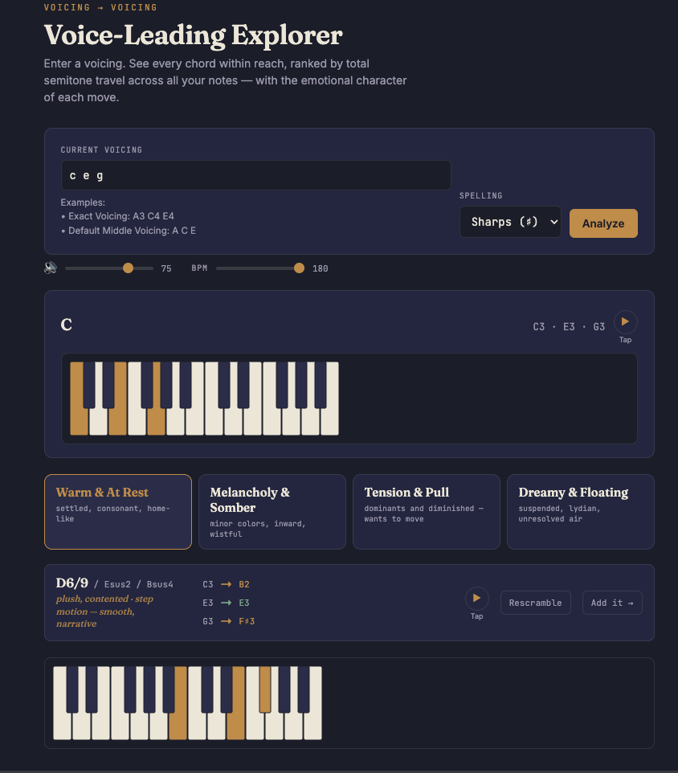

# Voice-Leading Explorer

> **Discover nearby harmonic possibilities through deterministic voice
> leading.**


> **A React application that analyzes a chord voicing and discovers
> harmonically related destinations by minimizing total voice
> movement.**

## Live Demo

[Open Voice-Leading Explorer](http://3.93.162.237)



------------------------------------------------------------------------

# Why I Built This

Most music software starts with chord progressions, scales, or
substitutions.

I wanted to build something different.

Voice-Leading Explorer starts with the exact voicing a musician is
hearing and asks a different question:

> **"What is the closest harmonic destination from here?"**

Instead of prescribing harmony, the application explores it through
deterministic voice-leading algorithms that minimize total semitone
movement while preserving realistic musical behavior.

Beyond solving a musical problem, this project became an opportunity to
design algorithms, organize complex theory into maintainable software
modules, and build a polished React application from the ground up.

------------------------------------------------------------------------

# Features

## Deterministic Voice-Leading Engine

-   Analyze any chord voicing
-   Generate every supported destination chord
-   Prioritize new-root candidates, then rank by minimum semitone movement
-   Distinct-note assignment using constrained backtracking
-   Enharmonic deduplication with alternate analyses preserved

## Rich Chord Recognition

Supports:

-   Triads
-   Seventh chords
-   Extended chords
-   Suspended chords
-   Altered dominants
-   Modern jazz chord qualities
-   Interval-formula fallback labels for unregistered note sets

## Negative Harmony

-   Reflect any voicing around its first note as the fixed pivot
-   Show the reflected shadow without replacing the current chord
-   Analyze inversions from their harmonic root rather than their lowest note
-   Play the shadow independently
-   Add the shadow directly to the progression trail

## Keyboard Visualization

-   Display current, generated, inspected, and shadow voicings on a piano
-   Mark the first/reference key with a subtle note-and-octave label
-   Respect the selected enharmonic spelling on keyboard markers

## Emotion-Based Discovery

Results are grouped into intuitive musical categories:

-   Warm & At Rest
-   Melancholy & Somber
-   Tension & Pull
-   Dreamy & Floating

## Progression Builder

-   Build progressions one discovery at a time
-   Add generated or negative-harmony voicings
-   Undo / rewind / remove
-   Inspect voicings
-   Re-analyze from any point

## Playback Engine

-   Sampled Salamander Grand Piano
-   FM synth fallback
-   Multiple playback modes
-   Full progression playback

------------------------------------------------------------------------

# Technologies

### Frontend

-   React
-   JavaScript (ES6+)
-   Vite

### Audio

-   Tone.js
-   Salamander Piano Samples

### Engineering

-   Git
-   GitHub
-   Docker
-   Node.js
-   npm

### Cloud

-   AWS deployment 

------------------------------------------------------------------------

# Architecture

``` text
User Input
      │
      ▼
Note Parsing
      │
      ▼
Candidate Generation
      │
      ▼
Voice-Leading Solver
      │
      ▼
Chord Recognition
      │
      ▼
Negative Harmony Analysis
      │
      ▼
Emotion Classification
      │
      ▼
Ranked Results
      │
      ▼
Playback Engine
```

------------------------------------------------------------------------

# Project Structure

``` text
voice-leading-explorer/

src/
├── VoiceLeadingExplorer.jsx
├── candidatePool.js
├── chordPatterns.js
├── negativeHarmony.js
├── noteParsing.js
└── main.jsx

standalone/
└── voice-leading-explorer.html
```

------------------------------------------------------------------------

# How the Theory Engine Works

1.  Parse the notes entered by the user.
2.  Generate every supported root and chord quality.
3.  Compute the minimum-total-movement mapping between the current
    voicing and each candidate.
4.  Guarantee unique destination notes with a constrained backtracking
    search.
5.  Remove duplicate note sets while preserving alternate chord names.
6.  Put new-root destinations first, then rank each group by total movement.
7.  Group the final results by emotional character.

## How Negative Harmony Works

1.  Treat the first note of the current voicing as the fixed pivot.
2.  Reflect every interval above the pivot downward by the same number of
    semitones.
3.  Order the reflected notes from their new lowest note upward for display
    and playback.
4.  Analyze the complete pitch set to find its harmonic root, including
    supported interpretations whose root is not played.
5.  Use conventional enharmonic spelling for the resulting chord and notes,
    independently of the main Sharps/Flats selector.
6.  If no registered chord matches, display the intervals measured from the
    shadow's lowest note instead of an unnamed result.
7.  Let the user audition the shadow or add it to the progression trail.

------------------------------------------------------------------------

# Getting Started

## Requirements

-   Node.js 18+
-   npm

## Install

``` bash
npm install
npm run dev
```

Open:

``` text
http://localhost:5173
```

## Production

``` bash
npm run build
npm run preview
```

Deploy the generated **dist/** directory to any static hosting provider.

------------------------------------------------------------------------

# Roadmap

-   Hero landing page
-   Saved progressions
-   MIDI export
-   Cloud synchronization
-   User accounts
-   Voice Neighborhood Mode
-   Journey Mode
-   Mobile optimization
-   Additional instrument libraries

------------------------------------------------------------------------

# License

This repository is currently shared as a portfolio project. A formal
open-source license has not yet been selected.

------------------------------------------------------------------------

## About This Project

This project represents my ongoing journey into software engineering,
combining algorithm design, React development, user experience, and
music theory into a single application. It serves as both a practical
musical tool and a demonstration of how I approach solving complex
technical problems through thoughtful software design.
